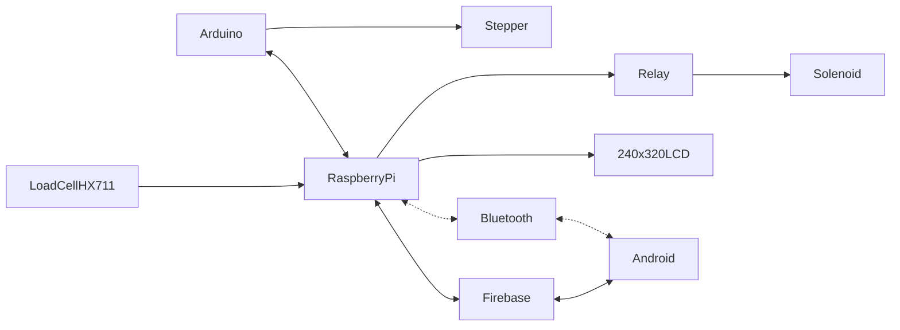

# Brief CENG Capstone Project Charter
-  [x] Select Project area:
1. [ ] :bike: Facilities: e.g. Bicycle Rental/Parking Lot/Vision System
2. [ ] :factory: Building Automation: e.g. Greenhouse/SolarPanel/Home
3. [ ] :movie_camera: Consumer: e.g. Entertainment Protocol DMX/Baby Monitoring Project
4. [ ] :mortar_board: Education: e.g. Robust Hackable Educational Project
5. [ ] :robot: Robotics: e.g. Control/Navigation/Dashboard
6. [x] :ski: Health and Wellness: e.g. Wearable
####  Project Title: 
Infant Health Monitor

####  Executive Summary/Description of the Project (75 to 100 words): 
The project's primary objective is the development of a specialized bracelet tailored for infants, capable of monitoring critical health metrics such as heart rate, oxygen levels, body temperature, movement, and ambient sound. This innovative device will seamlessly interface with an Android application designed to display and analyze this wealth of data.

Our ultimate vision is to empower parents and caregivers with a simple and efficient means of continuously monitoring their baby's health in real-time. By having their infant wear the bracelet, parents will be able to effortlessly track vital signs and receive timely alerts in the event of any anomalies. The accompanying app will offer an intuitive and user-friendly interface, enabling users to visualize data, identify trends, and even share vital information with healthcare professionals when necessary. Ultimately, our project strives to provide parents with the peace of mind that comes from knowing their baby's well-being is under vigilant and easily accessible observation.
####  Has this project been approved by all parties for posting (Y/N)?
-  [x] Yes
-  [ ] No

Optional Collaborator fields for sponsored projects

#### Sponsoring Industry and Personnel: 
#### Hours contributed: 
#### Number of full-time employees, year established, private or not-for-profit: 
#### Value of equipment or access to equipment provided: 
#### FAST contribution: 

####  List of Names of Students Involved in Project (first and last names and separate members by a comma):
NAMAN PAL, ZOYEBA MAHBUB, SATINDER KAUR, ESHAN SALWAN

####  Planned contact email for the [Expo submission form](https://appliedtechnology.humber.ca/shows/past-shows/advanced-manufacturing-projects/advanced-manufacturing-student-submission-form.html)

naman.pal@humber.ca

####  For each individual student state whether they have a complete parts kit, a multimeter, what development platform they have, what sensors/effectors they have along with system Requirements (List what sensors/effectors are to do), functionalty of prototype/describe any unsoldered connections.
Student One: Naman Pal (Manager)
- [x] Complete parts kit
- [ ] Multimeter
- Development platform: Broadcom single board computer
- Sensor/effector 1: ADXL 345 Triple Axes Accelerometer Sensor
- Unsoldered connection description: There are 8 total connections on the adxl 345 breakout board; including GND, VCC	(3.3V), CS	(Chip Select) used in SPI communication to select slave device; SDO (Serial Data Out) used in SPI communication to send data; INT1 and INT2 Interrupt 1 and 2 Outputs; SDA (Serial Data) used in I2C communication to send data; SCL (Serial Clock) used in I2C communication to sync data transmission  

Student Two: Eshan Salwan
- [x] Complete parts kit
- [ ] Multimeter
- Development platform: Broadcom single board computer
- Sensor/effector 2: LM393 microphone sound sensor
- Unsoldered connection description:  There are 4 total connections on the LM393 board; VCC (3.3V), GND, AO (Analog Output) real-time voltage signal of the microphone, DO (Digital Output) low and high level signal when the sound intensity reaches a threshold.

Student Three: Satinder Kaur
- [x] Complete parts kit
- [ ] Multimeter
- Development platform: Broadcom single board computer
- Sensor/effector 3: MAX30102 pulse oximetry and heart-rate sensor
- Unsoldered connection description:  Five functionally essential pins are present on the MAX30102 sensor. SCL and SDA enable I2C communication with external devices, while GND creates the ground reference and VIN establishes a connection to the power supply voltage. In addition, interrupts can be set off by particular events via the optional INT pin. 

Student Four:
- [ ] Complete parts kit
- [ ] Multimeter
- Development platform: Broadcom single board computer
- Sensor/effector 4:
- Unsoldered connection description:   

####  GitHub repository link(s):
https://github.com/ZoyebaMahbub5837/InfantHealthMonitor.git

####  Google Play App download link:
https://play.google.com/store/apps/details?id=ca.biobytes.it.infanthealthmonitor&pli=1

#### Hours per student:
$14\*3=42$ in class hours, $14\*3=42+$ outside of class.

#### Supervising Faculty: 
Kris Medri   
Meirion Williams

####  Hours per faculty: 
$14\frac{3}{20}\*3=6.3$ in class, $14\frac{1.05+1.49}{20}\*3=5.334+$ outside of class.

####  Scope:
Creation of a Prototype that is not to be left powered unattended. Keeping safety and Z462 in mind, the highest AC voltage that is to be used is 16Vrms from a wall adapter from which +/- 15V or as high as 45 VDC can be obtained. Maximum power consumption is to be 20 Watts. In alignment with the space below the tray in the Humber North Campus Electronics Parts kit the overall project maximum dimensions are 12 13/16" x 5 ¹/₂" x 2 ³/₄" = 32.5cm x 14cm x 7cm. If your PCB doesn’t work or you need to switch sensors/effectors, it is recommended that you use the SparkFun Qwiic system: https://www.sparkfun.com/products/15945

####  Design approach:

####  Mandate: 
Self funded (unless a sponsor has contractually agreed to contribute).
