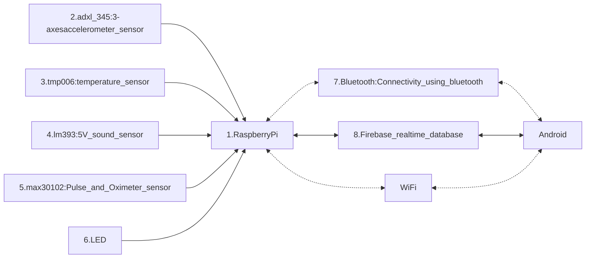

# Brief CENG Capstone Project Charter
-  [x] Select Project area:
1. [ ] :bike: Facilities: e.g. Bicycle Rental/Parking Lot/Vision System
2. [ ] :factory: Building Automation: e.g. Greenhouse/SolarPanel/Home
3. [ ] :movie_camera: Consumer: e.g. Entertainment Protocol DMX/Baby Monitoring Project
4. [ ] :mortar_board: Education: e.g. Robust Hackable Educational Project
5. [ ] :robot: Robotics: e.g. Control/Navigation/Dashboard
6. [x] :ski: Health and Wellness: e.g. Wearable
####  Project Title: 
Infant Health Monitor

####  Executive Summary/Description of the Project (75 to 100 words): 
Our project goal is to create a specialized infant bracelet that monitors crucial health metrics (heart rate, oxygen levels, temperature, movement, and ambient sound) and pairs it with an Android app. The app will analyze and provide insightful information about the baby's health on their parents' and caregivers' smartphones. It will also have continuous real-time health monitoring for their infants, allowing effortless tracking and timely anomaly alerts (as notifications). The user-friendly app enables data visualization, health trend identification, and easy sharing with healthcare professionals, providing peace of mind through vigilant and accessible observation of the baby's well-being.

####  Has this project been approved by all parties for posting (Y/N)?
-  [x] Yes
-  [ ] No

Optional Collaborator fields for sponsored projects

#### Sponsoring Industry and Personnel: 
#### Hours contributed: 
#### Number of full-time employees, year established, private or not-for-profit: 
#### Value of equipment or access to equipment provided: 
#### FAST contribution: 

####  List of Names of Students Involved in Project (first and last names and separate members by a comma):
NAMAN PAL, ZOYEBA MAHBUB, ESHAN SALWAN, SATINDER KAUR

####  Planned contact email for the [Expo submission form](https://appliedtechnology.humber.ca/shows/past-shows/advanced-manufacturing-projects/advanced-manufacturing-student-submission-form.html)

naman.pal@humber.ca

####  For each individual student state whether they have a complete parts kit, a multimeter, what development platform they have, what sensors/effectors they have along with system Requirements (List what sensors/effectors are to do), functionality of prototype/describe any unsoldered connections.
Student One (A): Naman Pal (Manager)
- [x] Complete parts kit
- [ ] Multimeter
- Development platform: Broadcom single board computer
- Sensor/effector 1: ADXL 345 Triple Axes Accelerometer Sensor
- Unsoldered connection description: There are 8 pins on the adxl 345 sensor breakout board. A female header has been soldered onto the PCB. The sensor (male pins) can be attached onto as well as removed from the female header on the PCB. These include: GND, VCC	(3.3V), CS	(Chip Select) used in SPI communication to select slave device; SDO (Serial Data Out) used in SPI communication to send data; INT1 and INT2 Interrupt 1 and 2 Outputs; SDA (Serial Data) used in I2C communication to send data; SCL (Serial Clock) used in I2C communication to sync data transmission  

Student Two (B): Zoyeba Mahbub
- [x] Complete parts kit
- [x] Multimeter
- Development platform: Broadcom single board computer
- Sensor 4: Temperature Sensor 2. tmp006: temperature sensor
- Effector: When the temperature sensor detects an abnormal reading, this effector will initiate data transmission to the software application. It will send the relevant data for further analysis and storage.
- Unsoldered connection description: To optimize assembly, female headers are soldered onto the PCB, while male headers are attached to the 2. tmp006: temperature sensor sensor, for its VCC (Voltage Supply), GND (Ground), SDA (Serial Data), and SCL (Serial Clock) pins. This approach ensures both a reliable initial connection and a convenient pathway for future upgrades. The pins, DRDY (Data Ready), AD1 (Address Bit 1), and AD0 (Address Bit 0), are currently not utilized in the current project configuration. They have been reserved for potential future expansions or the integration of advanced functionalities. 

Student Three (C): Eshan Salwan
- [x] Complete parts kit
- [ ] Multimeter
- Development platform: Broadcom single board computer
- Sensor/effector 2: LM393 microphone sound sensor
- Unsoldered connection description:  There are 4 total connections on the LM393 board; VCC (3.3V), GND, AO (Analog Output) real-time voltage signal of the microphone, DO (Digital Output) low and high level signal when the sound intensity reaches a threshold.

Student Four (D): Satinder Kaur
- [x] Complete parts kit
- [ ] Multimeter
- Development platform: Broadcom single board computer
- Sensor/effector 3: MAX30102 pulse oximetry and heart-rate sensor
- Unsoldered connection description:  Five functionally essential pins are present on the MAX30102 sensor. SCL and SDA enable I2C communication with external devices, while GND creates the ground reference and VIN establishes a connection to the power supply voltage. In addition, interrupts can be set off by particular events via the optional INT pin. 

####  GitHub repository link(s):
https://github.com/ZoyebaMahbub5837/InfantHealthMonitor.git

####  Google Play App download link:
https://play.google.com/store/apps/details?id=ca.biobytes.it.infanthealthmonitor&pli=1

#### Hours per student:
$14\*3=42$ in class hours, $14\*3=42+$ outside of class.

#### Supervising Faculty: 
Kris Medri   
Meirion Williams

####  Hours per faculty: 
$14\frac{3}{20}\*3=6.3$ in class, $14\frac{1.05+1.49}{20}\*3=5.334+$ outside of class.

####  Scope:
The main features of the mobile application in infant health monitor solution:

1. User Authentication
2. Real-Time Data Display
3. Alerts and Notifications
4. Data Logging and History
5. User Profiles and Permissions
6. Data Visualization
7. Offline Access
8. User-Friendly Interface

Here is a brief summary of the features you thought about but did not include in your prototype:

1. Module for wireless communication (such as Bluetooth)
2. GPS Unit
3. Mechanisms for Redundancy and Failover
4. Energy Planning and Battery Backup
To make the prototype's design and development simpler, some features were left out, however, they might be added in later iterations or improvements.

####  Design approach:

| ID | Component Name    | Description      |
|:---|:----------------  | :---------------:| 
| 1  | Python Hat        |   True   | 23.99 |
| 2  | SQL Hat           |   True   | 23.99 |
| 3  | Codecademy Tee    |  False   | 19.99 |
| 4  | Codecademy Hoodie |  False   | 42.99 |
| 5  | Codecademy Hoodie |  False   | 42.99 |
| 6  | Codecademy Hoodie |  False   | 42.99 |
| 7  | Codecademy Hoodie |  False   | 42.99 |
| 8  | Codecademy Hoodie |  False   | 42.99 |
| 9  | Codecademy Hoodie |  False   | 42.99 |
| 10 | Codecademy Hoodie |  False   | 42.99 |

####  Mandate: 
Self-funded (unless a sponsor has contractually agreed to contribute).
